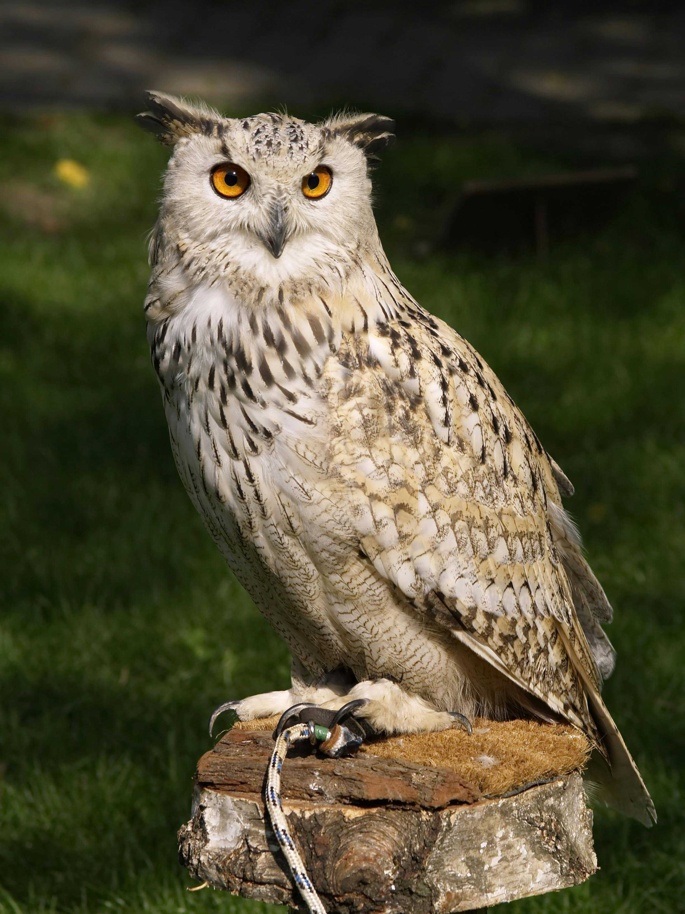

# Compress - Obsidian Plugin

This plugin allows you to quickly compress pasted images in Obsidian.

## Manually installing the plugin

- Copy over `main.js`, `styles.css`, `manifest.json` to your vault `VaultFolder/.obsidian/plugins/your-plugin-id/`.

## Original

## 50% compression

## Size Difference
